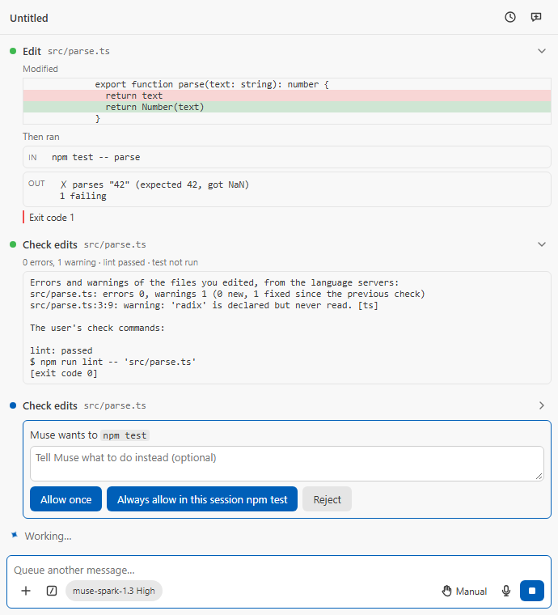

# M68: the verify loop

Recorded 2026-09-28 on branch `feature/m68-verify-loop`, from
`origin/plan/d49-competitive-program` at `2407109c` (main and the D49/D50
plan, PR #50). PLAN.md D49, milestone M68. Not pushed.

## The request

PLAN.md M68: every edit is checked, and the model sees the result without
asking. After a tool round that edited files, the next request carries the
new diagnostics of those files, capped, with changes against the previous
round; an optional format on edit; check commands (`museSpark.checkCommands`,
machine-scoped) that run automatically after every edit round by the shell
tool's permission path, scoped to the changed files after `--`, with a time
cap, and that the model can run itself; `then_run` on `write_file` and
`edit_file` (SoL-Pi's Action Fusion); a bounded fix loop. On Muse Code:
diagnostics through the existing `mcp__ide__getDiagnostics`, and the
guidance to verify sent as `MODEL_TEXT` in the turn.

## What was built

- **Settings** (all machine-scoped, D15; `package.json`, `SETTING_DEFAULTS`,
  `MACHINE_SCOPED_SETTINGS`): `diagnosticsAfterEdits` (on),
  `checkCommands` (none; each `{ name, command, changedFiles?,
timeoutSeconds? }`, validated whole by `checkCommandsSchema`: at most 8,
  names unique, 1 to 600 s, 300 s unless set) and `formatOnEdit` (off).
- **The automatic step** (`ModelApiSession.verifyRound`). It runs after each
  round in which `write_file` or `edit_file` wrote a file (not the shell,
  the memory tools or an image), after the round's hooks and before the next
  request. It reads the diagnostics, then runs the checks, shows a **Check
  edits** row (`verify_edits`: the files, errors and warnings, and each
  check's outcome), and replays the whole as one user note behind
  `MODEL_TEXT.verifyLead`, which calls it tool data and not an instruction.
- **Diagnostics** (`src/core/verify/diagnosticsReport.ts`): errors and
  warnings only, each file's counts with "N new, M fixed since the previous
  check" (matched by severity, source and message, never line), at most 50
  listed. Unreadable diagnostics are said so, never reported clean.
- **The editor side** (`src/host/editor/verifyEditor.ts`), see "What VS Code
  reports" below: each edited file that no editor shows opens beside the
  active editor as a preview without focus, then the loop waits for its
  server (3 s for a first report, 1 s of quiet, 8 s at most, a Stop ends
  it) and reads it. Files are read one at a time.
- **The permission path** (`authorizeCommand`), shared by the checks,
  `run_checks` and `then_run`: Restricted Mode refuses; the mode's shell
  verdict decides (Plan refuses, Bypass allows, Manual, Edit automatically
  and Auto ask); the card is the shell's own `shell` subject, so Edit
  automatically never answers it, and the PermissionRequest hook sees a
  shell call. "Always allow in this session" is keyed on the configured
  command without its paths, which is also the key of the shell tool's own
  call of that command line. A rejected check is not asked again in the
  turn; in Restricted Mode the automatic checks are left out.
- **Commands** run through the shell tool's own `runShell` (a job object on
  Windows, M27), from the workspace root, under the check's cap; a scoped
  check gets `--` and each edited path quoted for the shell (PowerShell or
  bash); a path starting with `-`, or holding a control character, keeps
  the check from running. A shell that cannot start is a failed check.
- **The fix loop**: three rounds in a row (`CHECK_FIX_MAX_ROUNDS`) whose
  checks failed or timed out stop the checks for the turn; the model is told
  to stop and say what still fails; the panel shows a warning notice. A
  passing round resets the count.
- **`run_checks`** (offered with the shell while checks are configured):
  the named checks (all by default) over the named paths (confined to the
  workspace) or the turn's edited files; a row with the same summary line.
- **`then_run`** (offered with the shell): after the edit and its format,
  the command takes the permission path above (a hook's forced question
  carries over), then runs only if the file's SHA-256 equals the
  fingerprint the edit left. The call keeps the edit's result and diff and
  adds the command's (`thenRun` on the item): the row shows **Then ran**
  with the command, its output and its exit or the reason it did not run.
  A Stop at its card keeps the edit's result. Reimplemented from the public
  description of Action Fusion; no SoL-Pi code was ported, so
  `scripts/third-party-notices.mjs` is unchanged (M73 remains the first
  milestone that may port).
- **Format on edit** (`formatAfterEdit`): `vscode.executeFormatDocumentProvider`
  once the document shows what the tool wrote (2 s to catch up, else
  skipped), within 5 s; the edits applied to the written text (BOM and CRLF
  kept), written back by the tool, the patch and the fingerprint taken
  after. A failed or overlapping formatter leaves the edit as written and is
  logged.
- **The instructions** gain "Checking your work", naming what arrives after
  edits, the checks, `run_checks` and `then_run` as they are offered.
- **Muse Code**: a second `<harness_note>` with each message, built by
  `verifyGuidance` from `MODEL_TEXT`: call `mcp__ide__getDiagnostics` on each
  edited file, and run the named checks (named only in a trusted
  workspace). The template AGENTS.md is unchanged; no skill is installed.
- **The `getDiagnostics` tool** (both backends): a request for one file now
  shows it and waits for its report first (`settleFile`), since otherwise it
  reports nothing for a file no editor shows.
- **Strings**: 21 keys in `en.ts` and the 14 tables, 7 manifest strings in
  the 15 manifest tables; `check:l10n` 0 problems (`verifyErrors.one` is the
  same word in Spanish, allowed in `untranslated.json`).
- **Harness**: scenario `verify` (an edit with a failing `then_run`, a
  Check edits row with its body open, a second one asking for `npm test`):
  

## What VS Code reports (measured)

The first integration run read nothing for a JSON file only opened with
`openTextDocument`. A probe in the Extension Development Host (VS Code
1.139.1, `--disable-extensions`, built-in servers) then gave, with a 25 s
first wait:

| File        | Shown in an editor | Result                             | Time      |
| ----------- | ------------------ | ---------------------------------- | --------- |
| shown1.ts   | yes (cold server)  | `Type 'string' is not assignable…` | 3,128 ms  |
| hidden.ts   | no (warm server)   | nothing                            | 25,003 ms |
| hidden.json | no                 | nothing                            | 25,012 ms |
| shown.json  | yes                | `Expected comma`                   | 1,555 ms  |

(The shown times include 1.5 s of quiet.) So the loop shows each file, and
the settle constants come from these numbers.

## Tests

- `verifyLoop.test.ts` (27), over the fake Model API with a fixture whose
  lint fails: the diagnostics and check results reach the next request and
  the row; nothing after a round without edits or without the loop;
  unreadable diagnostics; the fix loop stops at its limit, a passing round
  resets it, a new turn starts again; a shell that cannot start; the `-`
  path refused; Stop at a check card; **one test per mode**: Manual asks
  (after the edit's card), Auto asks, Bypass runs, Plan runs nothing
  (the edit refused, `run_checks` refused per check), Restricted Mode runs
  nothing and offers neither `run_checks` nor `then_run`; "Always allow in
  this session" (and the shell tool's same command); a rejected check not
  asked again; `run_checks` (offered with the names, whole project before
  edits, the turn's edits, named paths, and its refusals); `then_run` (one
  call two results, its card after the edit's, rejected, Restricted, Plan,
  the guard, the hash after format, Stop at its card, a failed edit);
  format on edit (on, off, a failing formatter); the instructions.
- `verifyEditor.test.ts` (11), over the `vscode` mock: shown beside as a
  preview without focus, the settle wait (first, quiet, cap, stop), Windows
  case folding, an already shown file not shown again, a file that cannot be
  opened or shown, `settleFile`; format on edit's options, BOM and CRLF,
  catching up, and every refusal (stale, dirty, changed, overlapping, slow,
  none, unchanged).
- `checkCommands.test.ts` (10, one skipped per platform): the schema, the
  command line, the refusals, the time cap, the Muse Code note, and a real
  round trip through Windows PowerShell 5.1 (bash elsewhere) proving each
  tricky path (spaces, both quotes, `$`, `;`, `|`, `&`, parentheses) reaches
  the command as one argument after `--`.
- `diagnosticsReport.test.ts` (6), `verifyRows.test.tsx` (7: the rows, the
  then_run block, the reducer, the Markdown export), `diagnostics.test.ts`
  (+1: a named file is settled first), `settings.test.ts` (+1),
  `conversationController.test.ts` (+1: the Muse Code note after the choice
  note, read per message).
- **Integration** (`test/integration/verifyEditor.test.ts`, inside VS Code
  1.139.1 and 1.125.0): hidden `.ts` and `.json` files shown and their errors
  read (5.8 s and 10.1 s, both files); `settleFile`; the JSON formatter. All
  13 integration tests pass on both versions.

## Red drills

Each guard broken in place, its suite run, the exact bytes restored and
checked by SHA-256 (never git): 26 of 26 fired, 26 restored.

| Drill                                                         | Suite                     | Exit |
| ------------------------------------------------------------- | ------------------------- | ---- |
| D1 a path starting with `-` is refused                        | checkCommands             | 1    |
| D2 a path with a control character is refused                 | checkCommands             | 1    |
| D3 each changed path is quoted as one argument                | checkCommands             | 1    |
| D4 an automatic check asks wherever a shell command asks      | verifyLoop                | 1    |
| D5 Plan refuses checks and then_run                           | verifyLoop                | 1    |
| D6 Restricted Mode refuses a check or then_run command        | verifyLoop                | 1    |
| D7 Restricted Mode leaves the automatic checks out            | verifyLoop                | 1    |
| D8 the fix loop stops at its limit                            | verifyLoop                | 1    |
| D9 a passing round resets the fix loop                        | verifyLoop                | 1    |
| D10 then_run's guard skips a file changed after the edit      | verifyLoop                | 1    |
| D11 format on edit runs before then_run's hash is taken       | verifyLoop                | 1    |
| D12 a rejected check is not asked again in the turn           | verifyLoop                | 1    |
| D13 "always allow in this session" keys on the command        | verifyLoop                | 1    |
| D14 a Stop at the then_run card keeps the edit and its diff   | verifyLoop                | 1    |
| D15 unreadable diagnostics are said so, never reported clean  | verifyLoop                | 1    |
| D16 the diagnostics and check results reach the next request  | verifyLoop                | 1    |
| D17 then_run is not offered without the shell                 | verifyLoop                | 1    |
| D18 run_checks is not offered without the shell               | verifyLoop                | 1    |
| D19 Muse Code gets the verify guidance in the turn            | conversationController    | 1    |
| D20 checkCommands is machine-scoped                           | manifest                  | 1    |
| D21 the editor matches files case-insensitively on Windows    | verifyEditor              | 1    |
| D22 an edited file is shown beside                            | verifyEditor              | 1    |
| D23 format on edit refuses a document that never caught up    | verifyEditor              | 1    |
| D24 the diagnostics tool settles a file it is asked about     | diagnostics               | 1    |
| D25 every new string is in every table                        | `check:l10n`              | 1    |
| D26 the accessibility gate covers the new rows (error colour) | `a11y.mjs verify` (Light) | 1    |

D26 put the then_run failure line in the error colour: axe reported
`color-contrast` 3.15:1 in Light Modern; restored, the scenario passes in
all four themes.

After the tests were refactored to remove duplication (below), D8, D9 and
D14 were run again: all three fired and restored. The drill script and its
JSON results are `scratchpad/m68-drills.mjs`, `m68-drills-first.json`
(all 25) and `m68-drills.json` (the rerun); D26 is
`scratchpad/m68-a11y-drill.mjs`.

## Gate runs

- Run 1 failed at `duplication`: two clones in `verifyLoop.test.ts` (the
  N-round script and the stop-at-first-card steps). Factored into
  `scriptWriteRounds` and `stopAtFirstCard`; jscpd then found 0 clones.
- Run 2 failed at `build`: the bundle-split gate (M57) named
  `verifyLoop.ts` and `verifyTools.ts` as on neither list. Both are used
  only by the host and its tools, so they joined `LAZY_ONLY`;
  `dist/modelApi.js` carries all 22 lazy files and `dist/extension.js`
  none. Everything before `build` passed in that run: 2,604 unit tests
  (25 skipped), coverage 94.4 % statements, 89.73 % branches, 96.13 %
  functions, 94.36 % lines.
- Run 3: `quality:gates` passed whole: format, lint (JS, CSS,
  PSScriptAnalyzer 0), five typechecks, `check:l10n` 0 problems, knip,
  dpdm, jscpd 0 clones, 2,604 unit tests (coverage as above), build with its
  size, split, globals and notices gates, and `npm audit` 0 advisories.
  `test:a11y` found **0 violations** on 338 of 340 pages but exited 1:
  headless Chrome crashed ("Network service crashed") on two pages of
  existing scenarios, `composer-max` (light) and `markdown` (hc-light), on a
  machine running other worktrees' gates. Rerun alone, those two and
  `verify` gave 12 pages, 0 violations, 0 without a result. Because the
  failed step stopped the run, `security:secrets` (gitleaks: no leaks) and
  `security:sast` (semgrep: 287 rules, 422 files, 0 findings) were run on
  their own and passed. No single `npm run quality` exited 0 end to end.

## Live checks

- **Model API** (`test/e2e/modelApi.live.e2e.test.ts` case19, contributor
  model `muse-spark-1.3-contributor`, an empty temporary workspace with
  `value.txt` and a `check.js` that fails while the file says BROKEN, the
  owner's key through `run-live-modelapi.ps1`, Auto mode with the answerer
  allowing each card once). Run twice (the first run's assertion looked at
  the wrong request and was fixed): **3 requests each, 6 model attempts in
  all**, about $0.0005 each, all HTTP 200. The model read the file, called
  `edit_file` with `then_run: node check.js` (passed, `CHECKOK value.txt`),
  the automatic check asked (two PowerShell cards, both allowed) and passed,
  and the request after the edit round ended `function_call_output`,
  `message:user`: Meta accepted the check note after the outputs and the new
  tool schemas (`then_run`, `run_checks` with an `enum` of names).
- **Muse Code**: not run. The note is a text part of `turn/start`, a shape
  captured long ago (the choice note rides the same way); what Muse Code does
  with it is model behaviour, and a Muse Code turn has cost about 31
  attempts. The `getDiagnostics` change is proven inside VS Code above.

## For the owner

- **Showing edited files.** Language servers report only on shown files, so
  the loop opens each edited file beside the active editor (a preview, no
  focus). This changes the layout the first time (a side group). The
  alternatives were the active group (text typed there could land in the
  agent's file) or no diagnostics for files no editor shows.
- **Upstream ask (not filed).** Automatic checks after Muse Code's own edits
  need an MSP signal, for example an event when a turn's edits are done (with
  the paths), or a completion hook on the edit tools. Draft for
  meta-models/muse-code-sdk: "Clients cannot run project checks after the
  agent edits files: MSP reports each edit item, but not when a round of
  edits is complete, so a client cannot run lint or tests between the edits
  and the model's next request. Could `muse serve` emit an event (or accept
  a client hook) after a tool round that wrote files, before the next model
  request, whose result the client can add to that request?"
- **Defaults.** Diagnostics after edits are on by default (they add the
  files' problems to the next request); check commands and format on edit
  are off until set.
