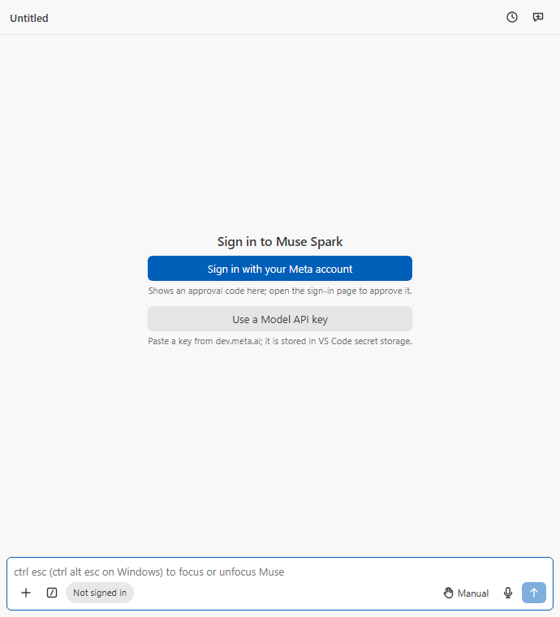

**Two ways in, never mixed.**

- **Sign in with your Meta account** shows an approval code in the panel: open the sign-in page in your browser and approve it. Work is billed to your Muse subscription. If the Muse Code CLI is missing, **Install Muse Code** first shows Meta's install command, runs it in a terminal and offers sign-in when the CLI appears.
- **Use a Model API key** takes a key from dev.meta.ai, keeps it in VS Code's secret storage and runs the extension's own tools, pay as you go. The key is never handed to the CLI.

**Muse Spark: Sign Out** in the Command Palette signs out of both.
